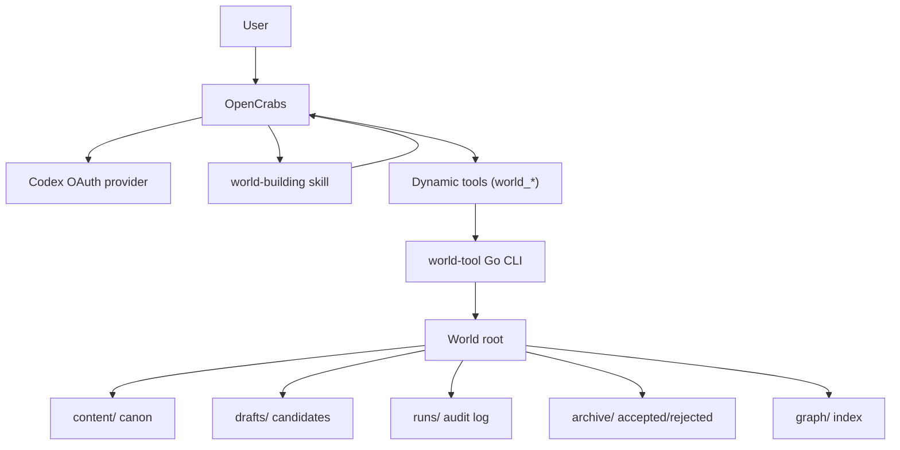
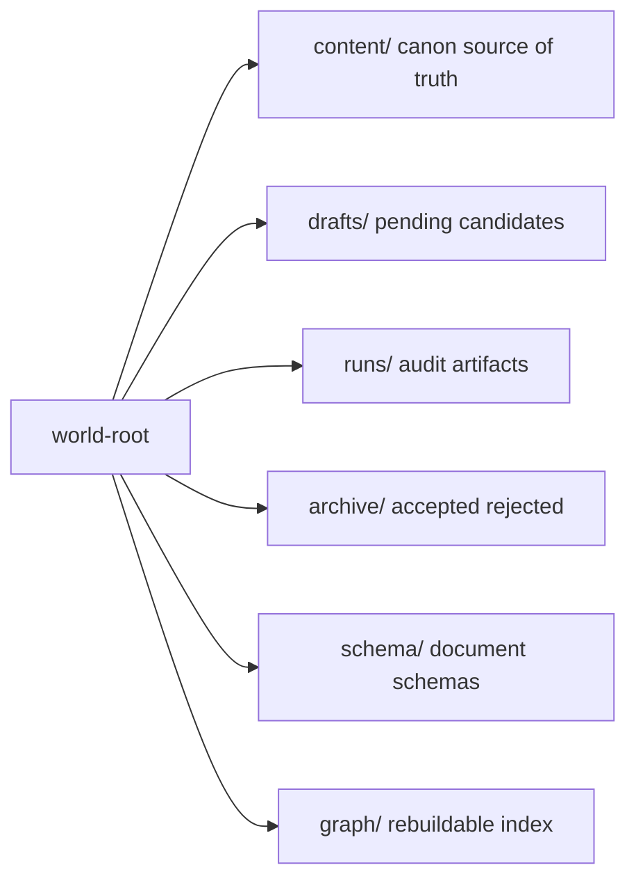
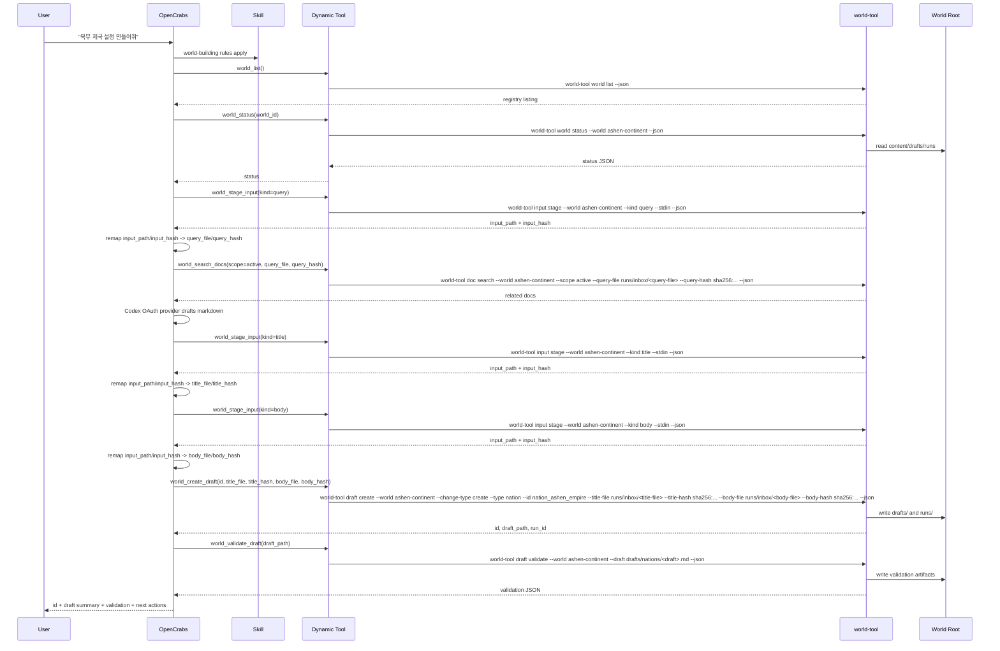
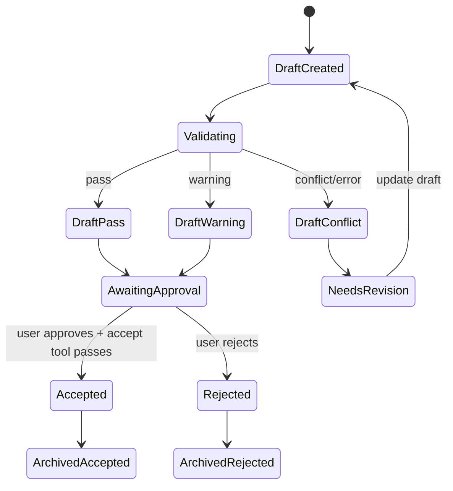

# system-design.md

# OpenCrabs World-Building System Design

## 1. 한 줄 정의
OpenCrabs가 하네스와 오케스트레이터 역할을 하고, 이 레포는 OpenCrabs가 세계관을 안전하게 관리하도록 `world-building` skill, dynamic tools, Go `world-tool` CLI를 제공한다.

이 문서는 구현 전의 목표 동작을 설명하는 설계 계약이다.

```text
판단과 대화: OpenCrabs + Codex OAuth provider
작업 규칙: world-building skill
상태 변경: world-tool Go CLI
원천 데이터: world root의 content/ Markdown
```

## 2. 전체 컴포넌트


## 3. 실행 책임
### OpenCrabs
- 사용자와 대화한다.
- Codex OAuth provider로 요청을 해석하고 draft 내용을 생성한다.
- `world-building` skill의 규칙을 따른다.
- `world_*` dynamic tools를 호출한다.
- tool output을 보고 다음 행동을 사용자에게 제안한다.

### world-building Skill
- `content/` 직접 수정 금지 같은 작업 원칙을 주입한다.
- draft → validate → diff → user approval → accept 순서를 안내한다.
- conflict/error 상태에서 accept하지 않도록 지시한다.
- 파일 작업은 반드시 `world_*` tools를 사용하게 한다.

### Dynamic Tools
- OpenCrabs가 호출할 수 있는 의미 단위 API다.
- shell executor로 `world-tool`을 호출한다.
- 범용 shell 실행을 열지 않는다.
- stdout JSON을 OpenCrabs가 해석한다.

### world-tool
- Go 단일 바이너리다.
- world root 밖 path를 기본적으로 차단한다. `approval attest`는 trusted auth context input만 read-only로 허용하며, production input은 wrapper-signed 또는 MACed envelope이거나 configured wrapper trust material로 검증 가능한 equivalent여야 하고, expected issuer/audience/scope policy를 만족해야 한다. hash/expiry 검증은 보조 무결성 확인일 뿐이다.
- Markdown/frontmatter를 파싱하고 정규화한다.
- validation, diff, accept/reject, runs log, recovery handling을 수행한다.
- recovery handling은 `world_recover_run` / `world-tool run recover`로만 수행하며, 원래 write command를 재실행하는 repair shortcut은 제공하지 않는다.
- unresolved recovery가 있으면 `world init`, `input stage`, `approval attest`, `draft create`, `draft update`, `draft validate`(validation artifact writer), `draft diff`, `draft accept`, `draft reject`, `content validate` artifact writer, `content migrate` report writer, 기타 content report writer를 포함한 같은 world root의 write command를 막고, `world_recover_run`만 write 예외로 남긴다. read-only inspection은 허용한다.
- `content/` 변경은 accept command에서만 허용한다.

## 4. World Root


`content/`가 canon source of truth다. OpenCrabs DB, search index, graph는 보조 데이터이며 content에서 재생성 가능해야 한다.
deprecated canon은 archive로 옮기지 않고 `content/` 내부에서 `status: deprecated`로 유지한다.

`runs/inbox/`는 privileged transient staging area다. normal browse/search/list 대상이 아니며, `input stage`와 `approval attest`만 여기에 write한다.

canonical root binding:

| Concept | Meaning |
| --- | --- |
| `world_id` | logical registry key. Docker `--root` mode에서는 `--world-id` 또는 `harness.yaml` provenance가 있을 때만 resolve하며, mount path 자체로 추론하지 않는다. |
| `registry_root` | registry 또는 provenance가 제공하는 host canonical root. host canonical provenance가 있으면 여기에 기록하고, 없으면 null이다. |
| `root` | 실제 tool process가 접근하는 effective root |
| audit fields | `world_id`, `registry_root`, `root`, `run_id` |

native execution에서는 `registry_root == root`가 되어야 한다. Docker에서는 registry root와 effective root인 `root`가 달라질 수 있으므로, audit/result envelope가 둘을 구분해 기록해야 한다.
Docker `--root` mode에서 registry/provenance가 host canonical root를 제공하면 `registry_root`에는 그 값을, `root`에는 container effective root를 기록한다. `--root`만 있고 host canonical root provenance가 없으면 host path를 invent하지 말고 `registry_root: null`, `root: <effective root>`로 기록하거나 root-only mode를 provenance 부족으로 제한해야 한다.

## 5. 주요 Tool 세트
| Tool | 내부 command | 역할 |
| --- | --- | --- |
| `world_list` | `world-tool world list` | registry에 등록된 world 목록 |
| `world_status` | `world-tool world status` | world 상태와 pending draft 요약 |
| `world_stage_input` | `world-tool input stage` | 긴 query/title/body/reason/retcon_reason을 runs/inbox에 staging하고 input path/hash를 반환 |
| `world_search_docs` | `world-tool doc search --scope active` | 관련 canon/draft 검색 |
| `world_read_doc` | `world-tool doc read` | 문서 읽기 |
| `world_create_draft` | `world-tool draft create` | canon 변경 없이 draft 생성 |
| `world_create_update_draft` | `world-tool draft create --change-type update` | 기존 canon 갱신/retcon draft 생성 |
| `world_create_deprecate_draft` | `world-tool draft create --change-type deprecate` | 기존 canon 폐기 draft 생성 |
| `world_update_draft` | `world-tool draft update` | draft 수정 |
| `world_read_draft` | `world-tool draft read` | active draft 읽기 |
| `world_validate_draft` | `world-tool draft validate` | schema/canon 검증 |
| `world_diff_draft` | `world-tool draft diff` | accept 예상 변경 확인 |
| `world_create_approval_attestation` | `world-tool approval attest` | trusted auth context input과 diff/reason hash binding, exact downstream action binding을 approval attestation으로 staging |
| `world_accept_draft` | `world-tool draft accept` | validation 후 content 승격, trusted approval attestation 필요, downstream_action은 `world_accept_draft`와 정확히 일치해야 함 |
| `world_force_accept_draft` | `world-tool draft accept --force` | 오퍼레이터가 승인한 예외 경로, trusted approval attestation과 policy limits 필요, downstream_action은 `world_force_accept_draft`와 정확히 일치해야 함 |
| `world_reject_draft` | `world-tool draft reject` | draft 반려 |
| `world_recover_run` | `world-tool run recover` | `TRANSACTION_INCOMPLETE` / unresolved recovery 정리 |
| `world_get_run` | `world-tool run get` | redacted manifest/status summary only |
| `world_get_run_artifact` | `world-tool run get --artifact` | allowlisted safe artifact를 basename으로 조회 |

## 6. Draft 생성 흐름


위 시퀀스는 schematic이지만 command contract를 깨지 않도록 필수 인자 `--world`, 파일 경로 입력, hash binding, approval attestation/provenance를 명시한다. `registry add`는 registration 관리 command이고, canonical 목록 조회는 `world list`다. `registry list`는 registry 파일 자체를 점검하는 운영/관리 alias로만 설명한다.
`diff_run_id`/`draft_hash`/`target_base_hash`/`patch_hash`는 `world_diff_draft`의 출력이고, create 경로에서는 `target_exists: false`와 `target_base_hash: null`이 계약이다. `input_path`/`input_hash`는 `world_stage_input`의 출력이고, OpenCrabs는 이를 kind별로 `query_file/query_hash`, `title_file/title_hash`, `body_file/body_hash`, `reason_file/reason_hash`, `retcon_reason_file/retcon_reason_hash`로 다시 매핑한다. create 경로의 `world_create_approval_attestation`과 `world_accept_draft`는 `--target-base-hash none`을 사용하고, update/deprecate 경로만 sha256 `target_base_hash`를 사용한다. `world_create_approval_attestation`은 `reason_hash`만 diff binding에 묶고, `reason_file`/`reason_hash`는 `world_accept_draft`/`world_force_accept_draft`가 소비한다. `world_create_approval_attestation`은 `downstream_action`을 exact bind하며, normal accept는 `world_accept_draft`, force accept는 `world_force_accept_draft`여야 한다. `world_create_approval_attestation`은 이 값들을 trusted auth context input의 `auth_context_file`/`auth_context_hash`와 함께 확인한다.

## 7. Accept 흐름

```mermaid
sequenceDiagram
    participant User
    participant OpenCrabs
    participant Tool as Dynamic Tool
    participant WT as world-tool
    participant World as World Root

    User->>OpenCrabs: "이 draft 승인해"
    OpenCrabs->>Tool: world_diff_draft(draft_path)
    Tool->>WT: world-tool draft diff --world ashen-continent --draft drafts/nations/<draft>.md --json
    WT-->>OpenCrabs: diff summary + diff_run_id + hashes
    OpenCrabs-->>User: 변경 내용 확인
    User->>OpenCrabs: "승인"
    OpenCrabs->>Tool: world_stage_input(kind=reason)
    Tool->>WT: world-tool input stage --world ashen-continent --kind reason --stdin --json
    WT-->>OpenCrabs: input_path + input_hash
    OpenCrabs->>OpenCrabs: remap input_path/input_hash -> reason_file/reason_hash
    OpenCrabs->>Tool: world_create_approval_attestation(diff_run_id, draft_hash, target_base_hash, patch_hash, approver_id, approval_channel, downstream_action, authenticated_actor, auth_context_file, auth_context_hash, reason_hash)
    Tool->>WT: world-tool approval attest --world ashen-continent --diff-run-id 20260530-010 --draft-hash sha256:... --target-base-hash none --patch-hash sha256:... --approver-id park.hana --approval-channel OpenCrabs-chat --downstream-action world_accept_draft --authenticated-actor openid:codex-oauth:user-123 --auth-context-file /tmp/opencrabs-auth-context.json --auth-context-hash sha256:... --reason-hash sha256:... --json
    WT-->>OpenCrabs: approval_attestation_file + approval_attestation_hash
    OpenCrabs->>Tool: world_accept_draft(draft_path, diff_run_id, draft_hash, target_base_hash, patch_hash, reason_file, reason_hash, approval_attestation_file, approval_attestation_hash, approver_id, approval_channel, authenticated_actor)
    Tool->>WT: world-tool draft accept --world ashen-continent --draft drafts/nations/<draft>.md --diff-run-id 20260530-010 --draft-hash sha256:... --target-base-hash none --patch-hash sha256:... --approver-id park.hana --approval-channel OpenCrabs-chat --approval-attestation-file runs/inbox/<approval-attestation>.json --approval-attestation-hash sha256:... --authenticated-actor openid:codex-oauth:user-123 --reason-file runs/inbox/<reason-file> --reason-hash sha256:... --json
    WT->>World: verify diff binding, exact downstream_action match, attestation provenance, and draft validate again
    alt validation pass or warning
        WT->>World: write content/
        WT->>World: move draft to archive/accepted/
        WT->>World: write runs/result.json
        WT-->>OpenCrabs: accepted JSON
        OpenCrabs-->>User: accepted + content path
    else conflict, error, or policy stop
        WT->>World: write blocked result
        WT-->>OpenCrabs: blocked JSON
        OpenCrabs-->>User: blocked reason + fixes
    end
```


## 8. 상태 전이


## 9. JSON 계약 예시
정식 JSON envelope는 [commands.md](commands.md)를 기준으로 한다. 아래 예시는 각 tool의 대표 payload다.

`world_create_draft` 결과:

```json
{
  "schema_version": "world-tool.v1",
  "ok": true,
  "command_status": "completed",
  "command": "draft.create",
  "world_id": "ashen-continent",
  "registry_root": "/host/worlds/ashen-continent",
  "root": "/workspace/world",
  "run_id": "20260530-001",
  "data": {
    "id": "nation_northern_empire",
    "draft_path": "drafts/nations/nation_northern_empire.md",
    "draft_hash": "sha256:..."
  },
  "issues": [],
  "available_actions": ["world_read_draft", "world_validate_draft", "world_diff_draft", "world_update_draft", "world_reject_draft"]
}
```

`world_validate_draft` 결과:

```json
{
  "schema_version": "world-tool.v1",
  "ok": true,
  "command_status": "completed",
  "command": "draft.validate",
  "world_id": "ashen-continent",
  "registry_root": "/host/worlds/ashen-continent",
  "root": "/workspace/world",
  "run_id": "20260530-001",
  "data": {
    "draft_path": "drafts/nations/nation_northern_empire.md",
    "draft_hash": "sha256:...",
    "validation_status": "warning"
  },
  "issues": [
    {
      "code": "TIMELINE_CONFLICT",
      "rule": "VR-203",
      "severity": "warning",
      "message": "기존 북부 왕국의 멸망 시점과 현재 통치 표현이 충돌할 수 있음",
      "recommendation": "후계 국가인지 역사 서술인지 명확히 할 것"
    }
  ],
  "available_actions": ["world_update_draft", "world_diff_draft", "world_reject_draft"]
}
```

`world_accept_draft` blocked 결과:

```json
{
  "schema_version": "world-tool.v1",
  "ok": true,
  "command_status": "blocked",
  "command": "draft.accept",
  "world_id": "ashen-continent",
  "registry_root": "/host/worlds/ashen-continent",
  "root": "/workspace/world",
  "run_id": "20260530-002",
  "data": {
    "draft_path": "drafts/nations/nation_northern_empire.md",
    "validation_status": "conflict",
    "block_reason": "VALIDATION_BLOCKED"
  },
  "issues": [
    {
      "code": "TIMELINE_CONFLICT",
      "rule": "VR-203",
      "severity": "conflict",
      "message": "이 draft는 기존 세계 연표의 성립 시점과 충돌하므로 accept할 수 없음"
    }
  ],
  "available_actions": ["world_update_draft", "world_reject_draft"]
}
```

이 예시에서는 `data.block_reason`과 `issues[].code`가 독립 채널이다. `data.block_reason`은 wrapper/domain 차원의 accept 차단 사유를 나타내고, `issues[].code`는 underlying validation cause를 드러낸다.

## 10. 내부 Go 모듈
```text
cmd/world-tool
  CLI entrypoint

internal/config
  registry, harness.yaml, CLI flags

internal/world
  world root resolution and path boundary

internal/docs
  markdown/frontmatter read/write/search

internal/drafts
  draft create/update/read/list

internal/validate
  structural, id, timeline, relationship rules

internal/diff
  content target path and patch generation

internal/audit
  run id, events.jsonl, result artifacts
```

## 11. 구현 순서
1. Go module과 `world-tool --version`
2. world root resolver와 path boundary
3. `world-tool registry add`
4. `world-tool world list`
5. `world-tool world init/status`
6. Markdown/frontmatter parser
7. `input stage`
8. `draft create/read/list/update`
9. `draft validate`
10. `draft diff`
11. `draft accept/reject`
12. `opencrabs/skills/world-building/SKILL.md`
13. `opencrabs/tools/world-tools.toml`
14. sample world root와 end-to-end smoke test

## 12. 설계 판단
- OpenCrabs가 이미 provider, skill, dynamic tools, channel UX를 제공하므로 별도 agent runtime을 만들지 않는다.
- `world-tool`은 AI SDK를 품지 않는다. AI 판단은 OpenCrabs/Codex가 한다.
- safety-critical 로직은 skill이 아니라 Go tool에서 강제한다.
- dynamic tools는 command template quoting 문제를 피하기 위해 긴 query/title/body/reason/retcon_reason을 `world_stage_input`으로 staging한 뒤 file path와 hash만 전달한다.
- 기본 provider는 Codex OAuth다. Codex CLI provider는 OAuth provider를 사용할 수 없는 환경에서만 fallback으로 둔다.
- OpenCrabs credential/config volume은 world root volume과 분리한다.
- world_id는 logical registry key, registry/provenance가 있으면 `registry_root`는 host canonical root, 없으면 null이며 `root`는 실제 execution/effective root다. Docker에서는 registry_root와 root를 분리해 audit하고, root field는 항상 실행 root 기준으로 해석한다.

## 13. MVP 준비 상태
현재 문서는 구현 전 설계 기준이다. 구현이 필요한 산출물은 다음이다.

- Go `world-tool` CLI
- `opencrabs/skills/world-building/SKILL.md`
- `opencrabs/tools/world-tools.toml`
- `schema/world-doc.schema.json`
- `schema/relationship-types.yaml`
- `examples/worlds/*` 샘플 world root
- end-to-end smoke test

가장 먼저 구현할 vertical slice:

```text
world-tool world init
→ world-tool registry add
→ world-tool world list
→ world-tool input stage --kind title
→ world-tool input stage --kind body
→ world-tool draft create
→ world-tool draft validate
→ world-tool draft diff
→ world-tool input stage --kind reason
→ world-tool approval attest
→ world-tool draft accept
```

## 14. 확장 포인트
- Graph rebuild/check: content에서 nodes/edges/orphan report 재생성
- Retcon 관리: frontmatter `retcon_reason`, source_run_id, force reason을 이용해 변경 이력 추적
- Multi-world registry: OpenCrabs 설정 또는 world-tool config로 world id와 root 매핑
- Validation strictness: world별 light/normal/strict 정책
- Archive storage: accepted/rejected archive pruning, compression, export
