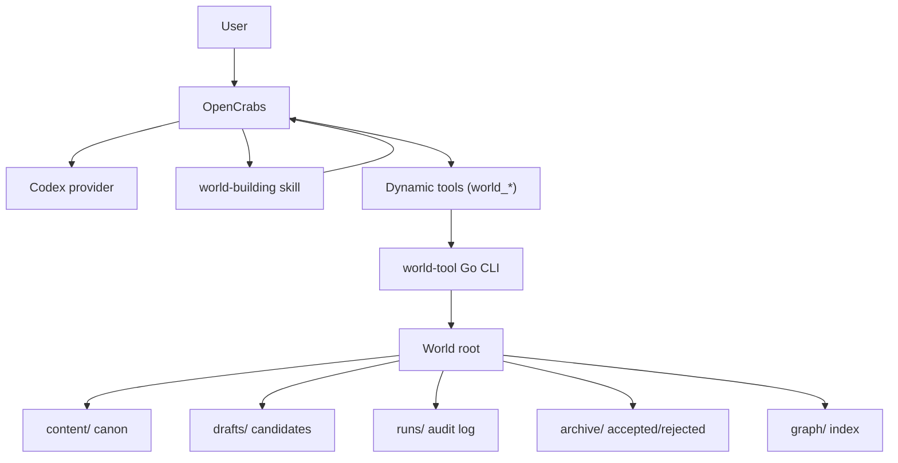
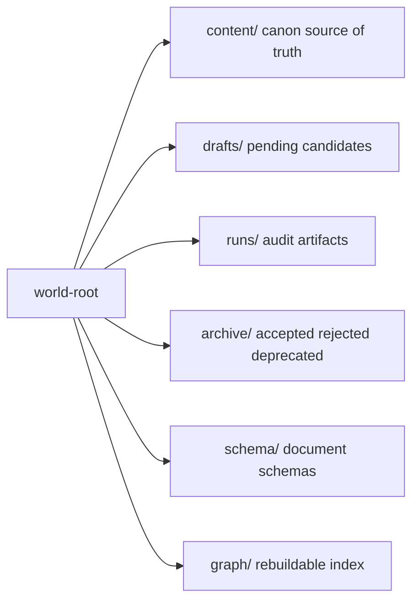
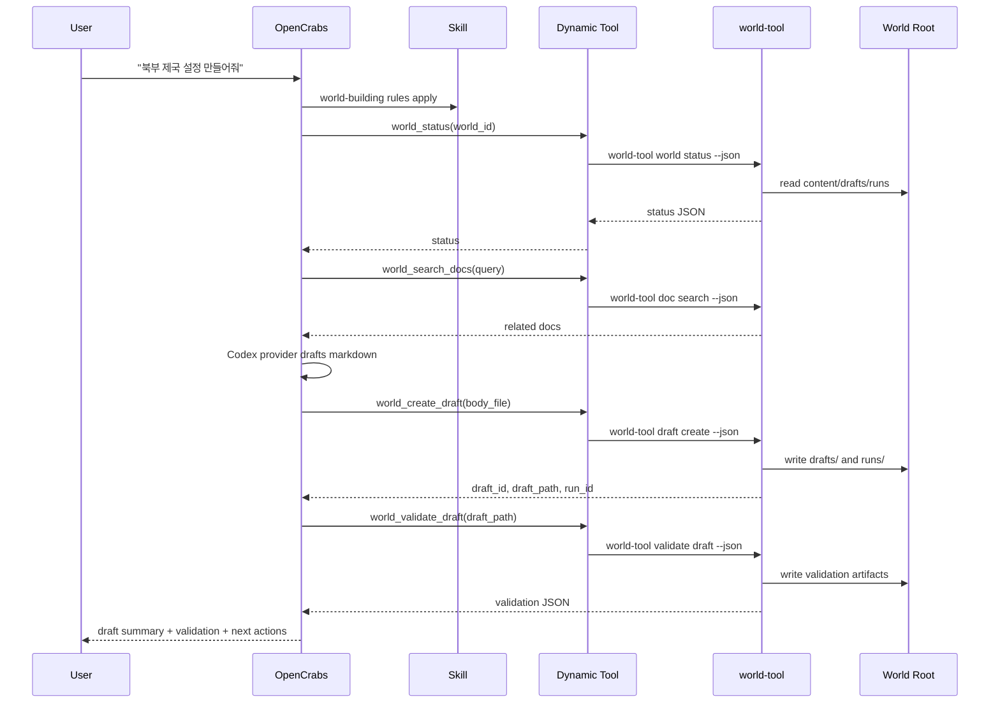
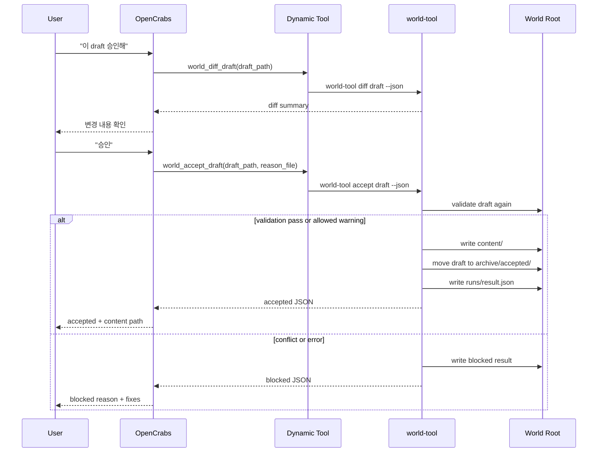
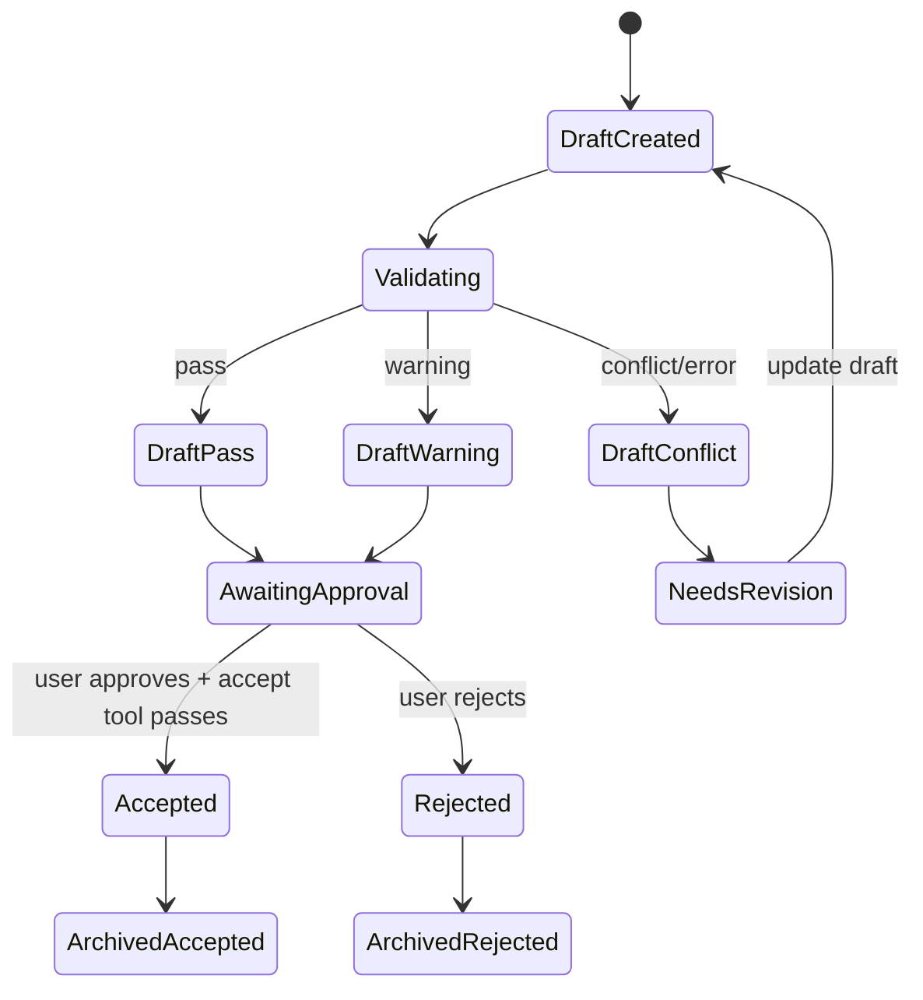

# system-design.md

# OpenCrabs World-Building System Design

## 1. 한 줄 정의
OpenCrabs가 하네스와 오케스트레이터 역할을 하고, 이 레포는 OpenCrabs가 세계관을 안전하게 관리하도록 `world-building` skill, dynamic tools, Go `world-tool` CLI를 제공한다.

```text
판단과 대화: OpenCrabs + Codex provider
작업 규칙: world-building skill
상태 변경: world-tool Go CLI
원천 데이터: world root의 content/ Markdown
```

## 2. 전체 컴포넌트


## 3. 실행 책임
### OpenCrabs
- 사용자와 대화한다.
- Codex provider로 요청을 해석하고 draft 내용을 생성한다.
- `world-building` skill의 규칙을 따른다.
- `world_*` dynamic tools를 호출한다.
- tool output을 보고 다음 행동을 사용자에게 제안한다.

### world-building Skill
- `content/` 직접 수정 금지 같은 작업 원칙을 주입한다.
- draft → validate → diff → user approval → accept 순서를 안내한다.
- conflict/error 상태에서 accept하지 않도록 지시한다.
- 파일 작업은 반드시 `world_*` tools를 사용하게 한다.

### Dynamic Tools
- OpenCrabs가 호출할 수 있는 의미 단위 API다.
- shell executor로 `world-tool`을 호출한다.
- 범용 shell 실행을 열지 않는다.
- stdout JSON을 OpenCrabs가 해석한다.

### world-tool
- Go 단일 바이너리다.
- world root 밖 path를 차단한다.
- Markdown/frontmatter를 파싱하고 정규화한다.
- validation, diff, accept/reject, runs log를 수행한다.
- `content/` 변경은 accept command에서만 허용한다.

## 4. World Root


`content/`가 canon source of truth다. OpenCrabs DB, search index, graph는 보조 데이터이며 content에서 재생성 가능해야 한다.

## 5. 주요 Tool 세트
| Tool | 내부 command | 역할 |
| --- | --- | --- |
| `world_status` | `world-tool world status` | world 상태와 pending draft 요약 |
| `world_search_docs` | `world-tool doc search` | 관련 canon/draft 검색 |
| `world_read_doc` | `world-tool doc read` | 문서 읽기 |
| `world_create_draft` | `world-tool draft create` | canon 변경 없이 draft 생성 |
| `world_update_draft` | `world-tool draft update` | draft 수정 |
| `world_validate_draft` | `world-tool validate draft` | schema/canon 검증 |
| `world_diff_draft` | `world-tool diff draft` | accept 예상 변경 확인 |
| `world_accept_draft` | `world-tool accept draft` | validation 후 content 승격 |
| `world_reject_draft` | `world-tool reject draft` | draft 반려 |
| `world_get_run` | `world-tool run get` | run artifact 조회 |

## 6. Draft 생성 흐름


## 7. Accept 흐름


## 8. 상태 전이


## 9. JSON 계약 예시
`world_create_draft` 결과:

```json
{
  "status": "created",
  "world_id": "ashen-continent",
  "draft_id": "draft_20260530_001",
  "draft_path": "drafts/nations/northern-empire.md",
  "run_id": "20260530-001",
  "available_actions": ["world_read_draft", "world_validate_draft", "world_diff_draft", "world_reject_draft"]
}
```

`world_validate_draft` 결과:

```json
{
  "status": "warning",
  "draft_path": "drafts/nations/northern-empire.md",
  "run_id": "20260530-001",
  "issues": [
    {
      "rule": "VR-203",
      "severity": "warning",
      "message": "기존 북부 왕국의 멸망 시점과 현재 통치 표현이 충돌할 수 있음",
      "recommendation": "후계 국가인지 역사 서술인지 명확히 할 것"
    }
  ],
  "available_actions": ["world_update_draft", "world_diff_draft", "world_accept_draft", "world_reject_draft"]
}
```

`world_accept_draft` blocked 결과:

```json
{
  "status": "blocked",
  "reason": "validation_conflict",
  "draft_path": "drafts/nations/northern-empire.md",
  "run_id": "20260530-002",
  "issues": [
    {
      "rule": "VR-101",
      "severity": "conflict",
      "message": "id nation_northern_empire already exists in content"
    }
  ],
  "available_actions": ["world_update_draft", "world_reject_draft"]
}
```

## 10. 내부 Go 모듈
```text
cmd/world-tool
  CLI entrypoint

internal/config
  registry, harness.yaml, CLI flags

internal/world
  world root resolution and path boundary

internal/docs
  markdown/frontmatter read/write/search

internal/drafts
  draft create/update/read/list

internal/validate
  structural, id, timeline, relationship rules

internal/diff
  content target path and patch generation

internal/audit
  run id, events.jsonl, result artifacts
```

## 11. 구현 순서
1. Go module과 `world-tool --version`
2. world root resolver와 path boundary
3. `world-tool world init/status`
4. Markdown/frontmatter parser
5. `draft create/read/list/update`
6. `validate draft`
7. `diff draft`
8. `accept/reject draft`
9. `opencrabs/skills/world-building/SKILL.md`
10. `opencrabs/tools/world-tools.toml`

## 12. 설계 판단
- OpenCrabs가 이미 provider, skill, dynamic tools, channel UX를 제공하므로 별도 agent runtime을 만들지 않는다.
- `world-tool`은 AI SDK를 품지 않는다. AI 판단은 OpenCrabs/Codex가 한다.
- safety-critical 로직은 skill이 아니라 Go tool에서 강제한다.
- dynamic tools는 command template quoting 문제를 피하기 위해 긴 body와 reason을 file/stdin 기반으로 전달한다.
